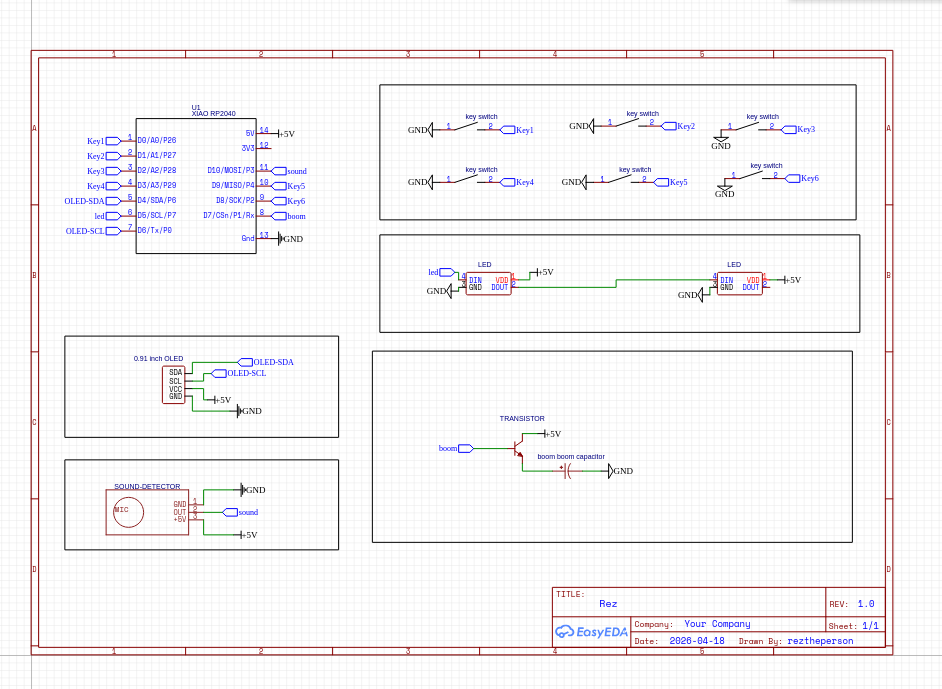

# VibesBoom: the vibecoders boom boom board!

_its 2026. you ovb dont know how to code_

a custom keyboard/hackpad for the vibe coders of the world with the additional boom boom

## why its awsome

6 buttons to do:

- the copy
- the paste
- open the Atlas AI browser
- open chatgpt app
- start voice input
- stop voice input

RGB LEDs to tell you if voice input is on or not

## And BEST killer feature:

_The boom boom reminder_: its 2026 you cant be slacking off!

a 3v capacitor that goes boom boom if you dont do anything in the past 30 sec... :O

dw dw you get an OLED to inform you of how much time you have left :)

## images

